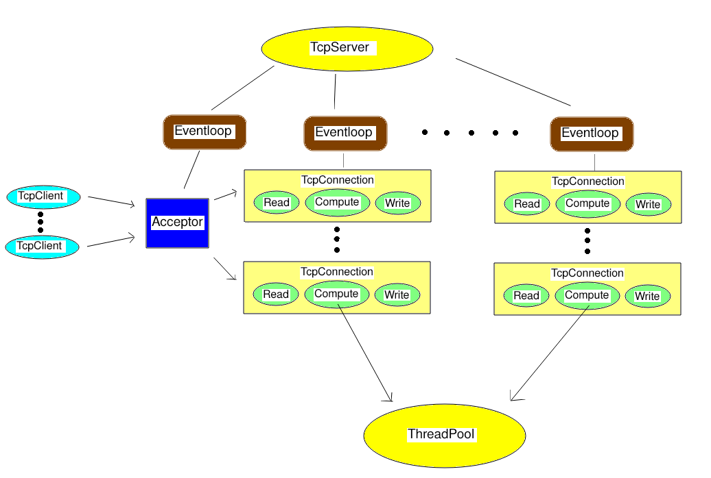

# Kiwi
Kiwi is a multi-thread network library implemented in Reactor design pattern
## Build
---
>**Linux kernel version requirement :** 2.6.22 or higher  
>**std::C++ version :** C++11  
>**Dependencies :** pthread
* Change your directory to folder *Kiwi* and use **cmake** to build the library  
* The output path is located at *release*  
* Change your directory to folder *example* and use **cmake** to build examples for this library  
* Change your directory to folder *unit_test* and use **cmake** to build unit tests for this library  
## Design Pattern
---

## Usage
---
**This library is under namespace Kiwi::**  
* `EventLoop()`  
  Inital an eventloop  
  This class is included in file *Ractor/EventLoop.h*
* `InetAddress()`  
  Inital an internet address  
  This class is included in file *Base/InetAddress.h*
* `void InetAddress::set_address(std::string address)`  
  Set ipv4 address in dot-decimal format **eg : "127.0.0.1"**
* `void InetAddress::set_address_any()`  
  Set ipv4 address to **INADDR_ANY**
* `void InetAddress::set_port(uint16_t port)`  
  Set port number
  ### For server :
* `TcpServer(EventLoop *base_loop, unsigned int io_thread_num, const InetAddress &acceptor_address)`  
  Initial a tcp server  
  Bind it to an eventloop , set the number of io thread and listen address  
  this class is included in file *Network/TcpServer.h*
* `void TcpServer::set_connection_handler(const Type::ConnectionHandler &handler)`  
  Set connection handler  
  Function type `ConnectionHandler = std::function<void(const TcpConnectionPtr &)>`  
  This function will be called after the server receive establish new connection  
* `void TcpServer::set_message_handler(const Type::MessageHandler &handler)`  
  Set message handler  
  Function type `MessageHandler = std::function<void(const TcpConnectionPtr &, const BufferPtr &, const TimeRange &)>`  
  This function will be called after the server receive a new  message  
* `void TcpServer::set_write_complete_handler(const Type::WriteCompleteHandler &handler)`  
  Set write complete handler  
  Function type `WriteCompleteHandler = std::function<void(const TcpConnectionPtr &)>`  
  This function will be called after the server write the data to kernel buffer  
* `void TcpServer::listen()`  
  Make the server listen on the previous set listen address  
* `void EventLoop::loop()`  
  Loop the eventloop  
  This function call will block the current thread
  ### For client :  
* `TcpClient(EventLoop *base_loop, const InetAddress &server_address, uint32_t client_id)`  
  Initial a tcp client  
  Bind it to an eventloop , set client ID and server address  
  This class is included in file *Network/TcpClient.h*
* The set handler member function is as well as TcpServer  
* `void TcpClient::connect()`  
  Try to connect to the specified server  
* `void EventLoop::loop()`  
  Loop the eventloop  
  This function call will block the current thread
